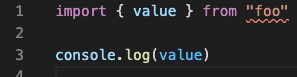

# importmap ESLint resolver [](https://www.npmjs.com/package/@jsenv/importmap-eslint-resolver) [](https://github.com/jsenv/importmap-eslint-resolver/actions?workflow=main) [](https://codecov.io/gh/jsenv/importmap-eslint-resolver)

If you use an importmap file and `import/no-unresolved` rule from `eslint-plugin-import`, some imports are reported as not resolved as shown in images below.

</br >


`@jsenv/importmap-eslint-resolver` exists to make `import/no-unresolved` compatible with importmap file.

— see [ESLint website](https://eslint.org)<br />
— see [eslint-plugin-import on github](https://github.com/benmosher/eslint-plugin-import)<br />
— see [importmap spec on github](https://github.com/WICG/import-maps)<br />

# Installation

Follow the steps below to enable importmap resolution for ESLint.

1 - Install _eslint-plugin-import_

```console
npm install --save-dev eslint-plugin-import
```

2 - Install _@jsenv/importmap-eslint-resolver_

```console
npm install --save-dev @jsenv/importmap-eslint-resolver
```

3 - Configure ESLint

Your ESLint config must:

- enable `"import"` in `plugins`
- configure `"import/resolver"` to use `@jsenv/importmap-eslint-resolver` as resolver
- configure `projectDirectoryUrl` and `importMapFileRelativeUrl`

The minimal `.eslintrc.cjs` file look like this:

```js
module.exports = {
  plugins: ["import"],
  settings: {
    "import/resolver": {
      "@jsenv/importmap-eslint-resolver": {
        projectDirectoryUrl: __dirname,
        importMapFileRelativeUrl: "./project.importmap",
      },
    },
  },
}
```

At this stage ESLint takes your importmap into account when trying to resolve imports. You can read the rest of this document to go further.

# Configuration

**By default** the resolution is:

- case sensitive
- browser like
  - consider node core modules (fs, url) as not found
  - do not implement node module resolution
  - do not understand path without extension (does not try to auto add extension)

This is the **default** behaviour, it can be configured to **match what you need**.

A typical project contains files written for browser AND node.js, you can read the [Advanced configuration example](#Advanced-configuration-example) to see how ESLint can be configured in these projects.

## Case sensitivity

This resolver is case sensitive by default: An import is found only if the import path and actual file on the filesystem have same case.

```js
import { getUser } from "./getUser.js"
```

The import above is found only if there is a file `getUser.js`. It won't be found if file is named `getuser.js`, even if the filesystem is case insensitive.

This ensure two things:

- Project is compatible with Windows or other operating system where filesystem is case sensitive.
- import paths are consistent with what is actually on the filesystem

You can disable case sensitivity as shown below:

_in \_eslintrc.cjs_:

```diff
module.exports = {
  plugins: ["import"],
  settings: {
    "import/resolver": {
      "@jsenv/importmap-eslint-resolver": {
        projectDirectoryUrl: __dirname,
        importMapFileRelativeUrl: "./project.importmap",
+       caseSensitive: false,
      },
    },
  },
}
```

## Import resolution

You need to tell the resolver how you expect import to be resolved.

1. Browser import resolution
2. Node import resolution

## Browser import resolution

This is the default behaviour. If you use an importmap give it to the resolver using "importMapFileRelativeUrl".

```diff
module.exports = {
  plugins: ["import"],
  settings: {
    "import/resolver": {
      "@jsenv/importmap-eslint-resolver": {
        projectDirectoryUrl: __dirname,
+       importMapFileRelativeUrl: "./project.importmap"
      },
    },
  },
}
```

If your files are written for browsers AND rely on [node esm resolution algorithm](https://nodejs.org/dist/latest-v16.x/docs/api/esm.html#esm_resolution_algorithm), the importmap must contain all mappings to mimic to node ES module resolution. You can use [@jsenv/importmap-node-module](https://github.com/jsenv/importmap-node-module) to do this.

When an importmap is used, this resolver gives a special treatment to "bare specifiers", just like a browser would. Be sure to read [Note on bare specifiers](#Note-on-bare-specifiers).

## Node import resolution

- For files written for Node.js with `import`:

  You can reuse importmap as explained in [Browser import resolution](#Browser-import-resolution). This is because there is no resolver implementing [node esm resolution algorithm](https://nodejs.org/dist/latest-v16.x/docs/api/esm.html#esm_resolution_algorithm) for now.

  You should also tell the resolver to consider node core modules (path, fs, url, ...) as found using "node: true";

  _in \_eslintrc.cjs_:

  ```diff
  module.exports = {
    plugins: ["import"],
    settings: {
      "import/resolver": {
        "@jsenv/importmap-eslint-resolver": {
          projectDirectoryUrl: __dirname,
          importMapFileRelativeUrl: "./project.importmap",
  +       node: true,
        },
      },
    },
  }
  ```

- For files written for Node.js with `require`:

  Enable Node CommonJS resolution using "node" resolver in your ESLint config file.

  _in \_eslintrc.cjs_:

  ```diff
  module.exports = {
    plugins: ["import"],
    settings: {
      "import/resolver": {
  +      "node": {}
      },
    },
  }
  ```

# Advanced configuration example

In a project mixing files written for the browser AND for Node.js you should tell ESLint which are which. This is possible thanks to "overrides" documented on ESLint in [Configuration Based on Glob Patterns](https://eslint.org/docs/user-guide/configuring/configuration-files#configuration-based-on-glob-patterns).

_eslintrc.cjs_:

```js
const eslintConfig = {
  plugins: ["import"],
  overrides: [],
}
// by default consider files as written for browsers
Object.assign(eslintConfig, {
  env: {
    es6: true,
    browser: true,
    node: false,
  },
  settings: {
    "import/resolver": {
      "@jsenv/importmap-eslint-resolver": {
        projectDirectoryUrl: __dirname,
        importMapFileRelativeUrl: "./project.importmap",
      },
    },
  },
})
// but for node and using Node ES module resolution algorithm on "*.mjs"
eslintConfig.overrides.push({
  files: ["**/*.mjs"],
  env: {
    es6: true,
    browser: false,
    node: true,
  },
  settings: {
    "import/resolver": {
      "@jsenv/importmap-eslint-resolver": {
        node: true,
      },
    },
  },
})
// and for node and using Node CommonJS resolution on "*.cjs"
eslintConfig.overrides.push({
  files: ["**/*.cjs"],
  env: {
    es6: true,
    browser: false,
    node: true,
  },
  settings: {
    "import/resolver": {
      node: true,
    },
  },
})
module.exports = eslintConfig
```

# Note on bare specifiers

A specifier is what is written after the from keyword in an import statement.

```js
import value from "specifier"
```

If there is no mapping of `"specifier"` to `"./specifier.js"` the imported file will not be found.
This is because import map consider `"specifier"` as a special kind of specifier called bare specifier.
And every bare specifier must have a mapping or it cannot be resolved.
To fix this either add a mapping or put explicitely `"./specifier.js"`.

Please note that `"specifier.js"` is also a bare specifier. You should write `"./specifier.js"` instead.
